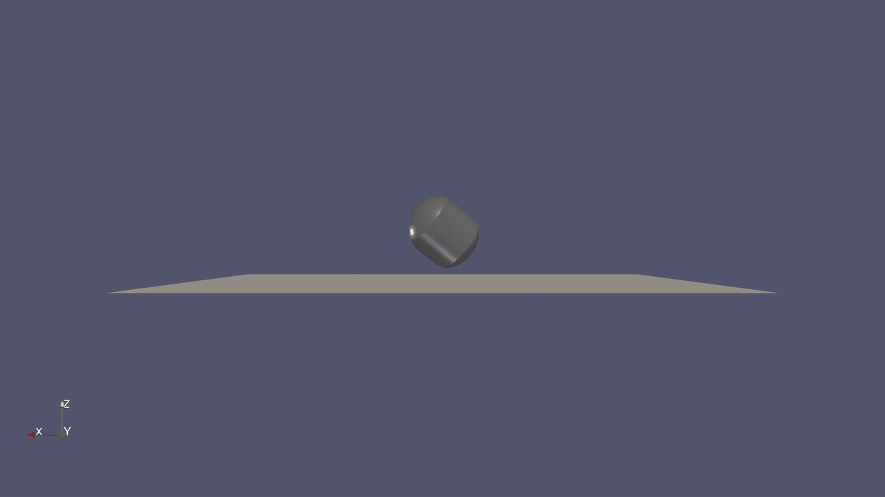
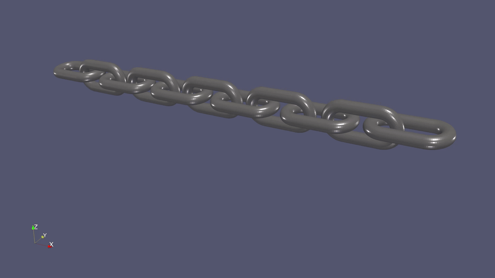

# FunDEMBeta

FunDEMBeta is a C++17 discrete-element framework for spherical and level-set particles, bonded and frictional contact, and SPH–DEM coupling. One host-side object definition supplies both CPU data and CUDA structure-of-arrays storage, so the same physical model can be executed by CPU, GPU, or supported hybrid solvers.

This README provides one complete path from a new development environment through the introductory tutorials and their results. Detailed interfaces and advanced workflows are documented in the [User Guide](docs/UserGuide.md).

Using a Mac? Follow the dedicated [macOS quick start](README_macOS.md) for a CPU-only build on Apple Silicon or Intel.

## Program framework

```text
Materials + geometries + particles
                │
                ▼
        Host AoS containers ─────────► CPU / OpenMP execution
                │
                │ DeviceLayout fields
                ▼
        Device SoA containers ───────► CUDA execution
                │
                ▼
      Solver synchronization and output
                │
                ├── particle/*.vtu
                ├── interaction/*.vtu
                └── energy.dat
```

The solver hierarchy is:

```text
solver
└── LSDEM          level-set DEM
    ├── SphereDEM  spheres coupled to level-set particles
    └── SPHDEM     SPH coupled to level-set particles
```

The source tree is divided by responsibility:

| Directory | Responsibility |
| --- | --- |
| `math/` | CPU/CUDA mathematical types and functions |
| `data/` | Host/device containers and VTU/DAT output |
| `material/` | Standard and level-set materials |
| `geometry/` | Reusable level-set geometry storage |
| `particle/` | DEM, level-set, SPH, virtual particles, and spatial grids |
| `interaction/` | Contacts, bonds, histories, and searches |
| `execution/` | Physical formulas shared by CPU and CUDA |
| `solver/` | Simulation lifecycle and execution modes |
| `tutorial/` | Small runnable demonstrations |
| `validation/` | Analytical, convergence, and backend-consistency cases |

## 1. Configure the environment

The commands below assume a Linux or WSL2 environment. Required tools are:

- Git;
- CMake 3.24 or newer;
- a C++17 compiler such as GCC;
- a build tool such as Ninja;
- an NVIDIA driver and CUDA toolkit for the GPU backend;
- ParaView for viewing VTU results.

On Ubuntu or WSL2, install the basic CPU tools with:

```bash
sudo apt update
sudo apt install -y build-essential git cmake ninja-build
```

The optional energy-plot command at the end also uses:

```bash
sudo apt install -y python3-numpy python3-matplotlib
```

Install the NVIDIA driver and CUDA toolkit using the instructions for the operating system and GPU. The driver must support the installed CUDA toolkit. Confirm the complete toolchain before configuring FunDEM:

```bash
git --version
cmake --version
g++ --version
ninja --version
nvcc --version
nvidia-smi
```

If `cmake --version` reports a version older than 3.24, install a newer CMake before continuing. `nvcc` and `nvidia-smi` must both work when CPU and GPU support are to be compiled together.

## 2. Download the source code

Create a workspace that keeps generated files outside the source directory:

```bash
mkdir -p FunDEM-workspace
cd FunDEM-workspace
git clone https://github.com/kaiqideng/FunDEMBeta.git
cd FunDEMBeta
```

The resulting layout will be:

```text
FunDEM-workspace/
├── FunDEMBeta/  source code
└── build/       generated in the next step
```

## 3. Build CPU and GPU support

Use one Release configuration with CUDA and OpenMP enabled. Tutorials are built, while larger examples and tests are omitted from this first build:

```bash
cmake -S . -B ../build -G Ninja \
    -DCMAKE_BUILD_TYPE=Release \
    -DFUNDEM_ENABLE_CUDA=ON \
    -DFUNDEM_ENABLE_OPENMP=ON \
    -DFUNDEM_BUILD_TUTORIALS=ON \
    -DFUNDEM_BUILD_EXAMPLES=OFF \
    -DBUILD_TESTING=OFF

cmake --build ../build --parallel
```

CPU code is always compiled. When CUDA is found, the same configuration also compiles the CUDA libraries and kernels. During configuration, confirm that CMake reports an NVIDIA CUDA compiler. If it prints `CUDA compiler not found`, the build contains CPU support only; make `nvcc` available on `PATH`, remove `build/`, and configure again.

## 4. Run the tutorials

### Tutorial 0: Gömböc self-righting

`tutorial0` drops a ceramic level-set Gömböc onto a fixed plane and demonstrates its self-righting motion. The case uses the default CPU execution mode, advances with a `1e-4 s` time step for 120 seconds, and writes a frame every `0.05 s`.

Run it from the workspace directory:

```bash
../build/tutorial/tutorial0
```

[](docs/assets/tutorial0.mp4)

The animation plays directly in the README. Click it to open the full 1080p MP4.

### Tutorial 1: interlocked level-set chain

`tutorial1` contains eleven physically interlocked level-set chain links. The two end links have infinite mass, the remaining links fall under gravity, and no artificial bonds are used. It simulates 2 seconds with a `2.0e-5 s` DEM time step and writes a frame every `0.01 s`.

The tutorial intentionally uses the default CPU execution mode. The CUDA backend remains available in the same build for GPU-enabled user simulations.

Run it from the workspace directory:

```bash
../build/tutorial/tutorial1
```

The terminal reports the calculated step count, physical time, output-frame index, and allocated device memory at every frame. Results are written beside the executable:

```text
../build/tutorial/tutorial1_files/
├── particle/
│   ├── LSParticle_000000.vtu
│   ├── LSParticle_000001.vtu
│   ├── fixedLSParticle_000000.vtu
│   └── ...
├── interaction/
│   ├── LSParticleContact_*.vtu
│   └── ...
└── energy.dat
```



## 5. View the DEM result

Open ParaView and load these two file series:

```text
../build/tutorial/tutorial1_files/particle/LSParticle_*.vtu
../build/tutorial/tutorial1_files/particle/fixedLSParticle_*.vtu
```

ParaView normally recognizes the numbered files as time series. Select both readers in the Pipeline Browser, click **Apply**, press **Reset Camera**, and use **Play** to animate the chain. Load `interaction/LSParticleContact_*.vtu` as another series when contact points and normals are also required.

VTU is appended binary by default. ParaView reads it directly; no conversion is necessary.

## 6. View the DEM system energy

`energy.dat` is a whitespace-separated text table. Inspect its header and first frames with:

```bash
head -n 6 ../build/tutorial/tutorial1_files/energy.dat
```

Each row contains simulation time followed by solid-particle kinetic energy, gravitational potential energy, contact elastic energy, bond elastic energy, and `totalEnergy`. SPH-fluid energy is intentionally excluded from this DEM energy record.

To plot the important energy groups with the NumPy and Matplotlib packages installed in Section 1, run:

```bash
python3 - <<'PY'
from pathlib import Path

import matplotlib.pyplot as plt
import numpy as np

path = Path("../build/tutorial/tutorial1_files/energy.dat")
energy = np.genfromtxt(path, names=True)
elastic_names = [name for name in energy.dtype.names if name.endswith("ElasticEnergy")]
elastic = sum((energy[name] for name in elastic_names), np.zeros_like(energy["time"]))

plt.plot(energy["time"], energy["kineticEnergy"], label="kinetic")
plt.plot(energy["time"], energy["gravitationalPotentialEnergy"], label="gravitational")
plt.plot(energy["time"], elastic, label="contact + bond elastic")
plt.plot(energy["time"], energy["totalEnergy"], label="total", linewidth=2)
plt.xlabel("time [s]")
plt.ylabel("energy [J]")
plt.grid(True)
plt.legend()
plt.tight_layout()
plt.show()
PY
```

`totalEnergy` is the sum of the reported DEM mechanical-energy components. It may decrease because restitution, friction, and damping dissipate energy; dissipated energy is not stored as an additional state component.
