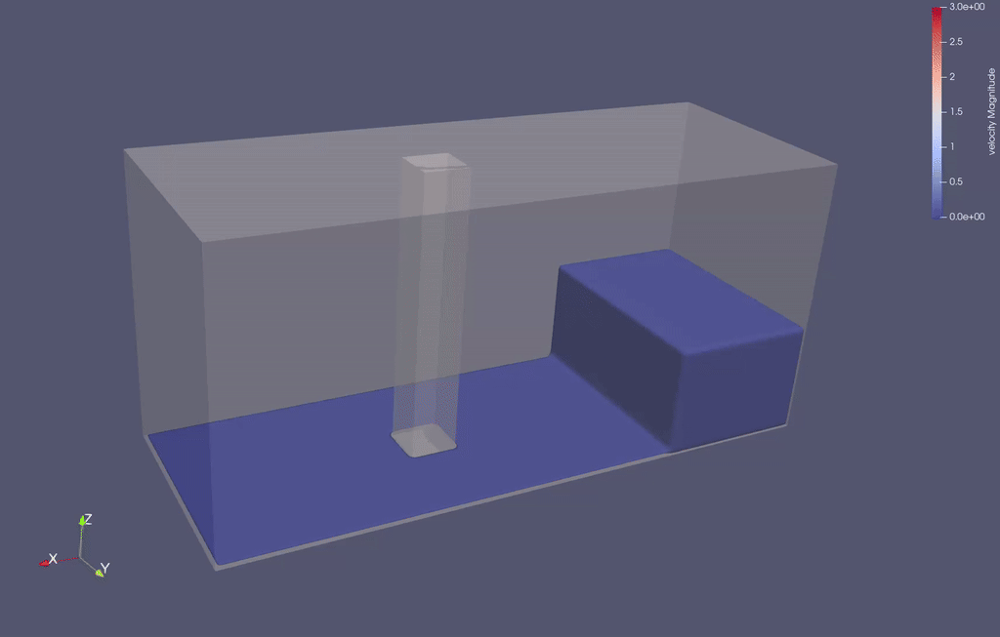

# `tutorial/`

> **Purpose:** Provide compact level-set, sphere, bonded-particle, and SPH–DEM tutorials.

## Contents

| File | Purpose |
| --- | --- |
| `tutorial0.cpp` | CPU Gömböc self-righting case |
| `tutorial1.cpp` | Eleven physically interlocked anchor-chain links with fixed endpoints |
| `tutorial2.cpp` | Bonded spherical-particle cloth falling onto a fixed level-set box |
| `tutorial2DampingKernel.cu` / `.cuh` | Tutorial-local CUDA counterpart of the cloth's external particle damping |
| `tutorial3.cpp` | Classical three-dimensional bore-in-a-box SPH benchmark |
| `tutorialOptions.h` | Shared execution-mode and output arguments for tutorial2 and tutorial3 |
| `Gomboc.obj` | Surface mesh copied beside the executable after building |

All tutorials use CPU execution by default even when FunDEM is configured with CUDA. Tutorial2 and tutorial3 also accept `--mode gpu` and `--mode hybrid` so the same compact case can exercise another backend without creating backend-specific executables.

## Corresponding Workbench Samples

The default calculation durations and requested VTU output intervals match the corresponding FunDEM Workbench samples:

| Tutorial | Software sample | Duration | VTU interval |
| --- | --- | --- | --- |
| `tutorial0` | `gombocSelfRighting.fundem.json` | 120 s | 0.05 s |
| `tutorial1` | `interlockedChain.fundem.json` | 3 s | 0.05 s |
| `tutorial2` | `clothBoxDrop.fundem.json` | 3 s | 0.05 s |
| `tutorial3` | `damBreakSquareColumn.fundem.json` | 3 s | 0.05 s |

Tutorial2 also matches the software sample's cloth discretization, material properties, and external damping. Its damping is implemented through the solver's ordinary external-force hooks, so no Workbench force-module library is required. Tutorial3 retains column-force recording, which the software sample omits. Tutorials retain their own output-field selection and explicit spatial-search boundaries; these are not copies of the software's presentation settings or automatic domain calculation.

## Tutorial 0: Gömböc Self-Righting

- The Gömböc uses a ceramic-like density of `2400 kg/m³` and level-set normal/shear penalty stiffnesses per unit area of `2.4e10` and `7.1e9`.
- The 64-cell level-set geometry advances with a default `1e-4 s` time step.
- The solver runs directly for `120 s`; there is no automatic settling test or early termination.
- Binary VTU frames are written every `0.05 s` by default.

## Tutorial 1: Interlocked Anchor Chain

- Eleven links begin horizontally along the X axis with alternating `0°` and `90°` orientations and a `0.07 m` pitch.
- Adjacent links are topologically interlocked with an initial surface clearance; no bond interaction is used.
- The leftmost and rightmost links have infinite mass, while the nine interior links sag under gravity.
- The CPU solver advances `3 s` with a `2e-5 s` time step and writes binary VTU output every `0.05 s`.

## Tutorial 2: Bonded-Particle Cloth Falling onto a Box

- Exactly 9,951 equal spheres (`93 x 107 x 1`) form a horizontal staggered triangular lattice above a fixed level-set box, with 29,454 nearest-neighbor bonds.
- Sphere diameter is `0.006417112299465241 m`, density is `1500 kg/m3`, and the cloth is centered over the unchanged `0.24 x 0.24 x 0.24 m` box at `(0.30, 0.30, 0.12) m`. Sphere centers start at `z = 0.38 m`.
- Horizontal and diagonal nearest neighbors are joined by tensile, shear, bending, and torsional bonds derived from the cloth Young's modulus, Poisson ratio, thickness, and density.
- The free cloth falls under gravity and drapes over the box; no cloth edge is artificially fixed.
- Sliding friction is `0.6` and restitution is `0.05` for both materials. The cloth's external damping adds `F = -20 m v` and `T = -3.418598284e-8 omega` in SI units; the fixed box receives no damping. CPU, GPU, and hybrid modes use the same formulas.
- Bonds have zero fracture area and cannot break. The four beam stiffnesses use `E = 1e6 Pa`, `nu = 0.3`, and the smaller sphere diameter, exactly as in the software sample.
- The case advances `3.0 s` with a fixed `1e-5 s` DEM time step (300,000 steps) and writes binary VTU output every `0.05 s` (5,000 steps). This is deliberately dissipative, not an energy-conservation test.

## Tutorial 3: Dam Break Around a Square Column

- The geometry uses a closed `1.60 × 0.61 × 0.75 m` tank, a `0.40 × 0.61 × 0.30 m` reservoir, a `0.01 m` downstream wet bed, and a `0.12 × 0.12 × 0.75 m` square column.
- The column's upstream face is `0.50 m` downstream of the gate and its two lateral clearances are `0.24 m` and `0.25 m`.
- A `0.01 m` particle spacing represents the wet bed with one particle layer. The reservoir and obstacle-excluded wet bed contain 80,376 particles in total.
- A reversed `BoxWall` level set places boundary samples immediately outside all six faces of the closed fluid cavity, including continuous edge and corner support.
- The case advances `3.0 s` with a `2e-5 s` base DEM time step and writes binary VTU output every `0.05 s`.
- `columnForce.dat` records a uniform column-reaction sample at every `2e-5 s` DEM base step. The most recently computed SPH load is retained between acoustic updates.
- `columnForceFiltered.dat` is generated after the solve with a centered `13 ms` triangular moving average. Both files contain `forceX`, `forceY`, `forceZ`, and the horizontal magnitude.



The current animation previews the initial 1.5-second impact interval; regenerate it from the extended run when the complete 3-second result is available.

Reference publications:

- M. Gómez-Gesteira and R. A. Dalrymple, [Using a Three-Dimensional Smoothed Particle Hydrodynamics Method for Wave Impact on a Tall Structure](https://doi.org/10.1061/%28ASCE%290733-950X%282004%29130%3A2%2863%29), 2004.
- S. J. Cummins, T. B. Silvester, and P. W. Cleary, [Three-dimensional wave impact on a rigid structure using smoothed particle hydrodynamics](https://doi.org/10.1002/FLD.2539), 2012.

## Build and Run

Run from the directory containing `FunDEMBeta/`:

```bash
cmake -S FunDEMBeta -B build -DFUNDEM_BUILD_TUTORIALS=ON
cmake --build build --target tutorial0 tutorial1 tutorial2 tutorial3 -j
build/tutorial/tutorial0
build/tutorial/tutorial1
build/tutorial/tutorial2
build/tutorial/tutorial3
```

The default output directories are `tutorial0_files/` through `tutorial3_files/` beside their executables. Relative `--output` paths are resolved from the executable directory.

Tutorial0 options are:

```text
--time-step DT
--duration T
--steps N
--output DIR
--ascii
```

`--steps` overrides the duration-derived step count and is useful for short smoke runs.

Tutorial2 and tutorial3 accept:

```text
--steps N
--mode cpu|gpu|hybrid
--device N
--output DIR
--ascii
```

The device value is used only by GPU and Hybrid execution. GPU and Hybrid modes require a CUDA-enabled FunDEM build.

## Tutorial Design Rules

Tutorials are intentionally compact and deterministic enough to read from top to bottom. They use public solver construction APIs, default CPU execution, binary output, and no hidden setup files other than the Gömböc mesh. Larger SPH validation and CUDA performance cases remain in `example/`.

Each tutorial demonstrates a different FunDEM capability:

| Tutorial | Main concepts |
| --- | --- |
| `tutorial0` | OBJ input, movable/fixed LS geometry, material assignment, gravity, self-righting, periodic output |
| `tutorial1` | Reusable chain-link geometry, multiple LS particles, orientation, infinite-mass endpoints, physical interlocking without bonds |
| `tutorial2` | Triangular sphere lattice, beam-like bond stiffness, sphere–LS contact, cloth draping over a box |
| `tutorial3` | Bore-in-a-box SPH benchmark, wet bed, closed tank, flow separation, and square-column reaction force |

## Output and Runtime Expectations

The first solve clears old `.vtu` and `.dat` files below the selected tutorial output directory. Frame zero is written before motion. A smoke run shorter than the output interval may therefore contain only the initial frame.

Tutorial0 accepts runtime duration and time-step arguments; changing the time step does not recalibrate contact parameters or prove stability. Tutorial1 keeps its physical constants in source so the interlocking setup remains easy to inspect. Tutorial2 and tutorial3 expose backend selection but keep their discretization and time step in source. None of the tutorials automatically stops at equilibrium.

For a quick build check:

```bash
build/tutorial/tutorial0 --steps 10 --output tutorial0_smoke
```

For the documented animation, run the full duration with the original parameters and inspect all generated frames. ASCII output is useful only for diagnosing a small frame because it is considerably larger and slower.

## Modifying a Tutorial

When creating a new tutorial, keep the executable name free of backend suffixes, choose CPU as the default, use one clear physical idea, and document its expected duration/output cadence here. Runtime options should validate values and resolve relative output paths from the executable directory consistently with the existing cases.
